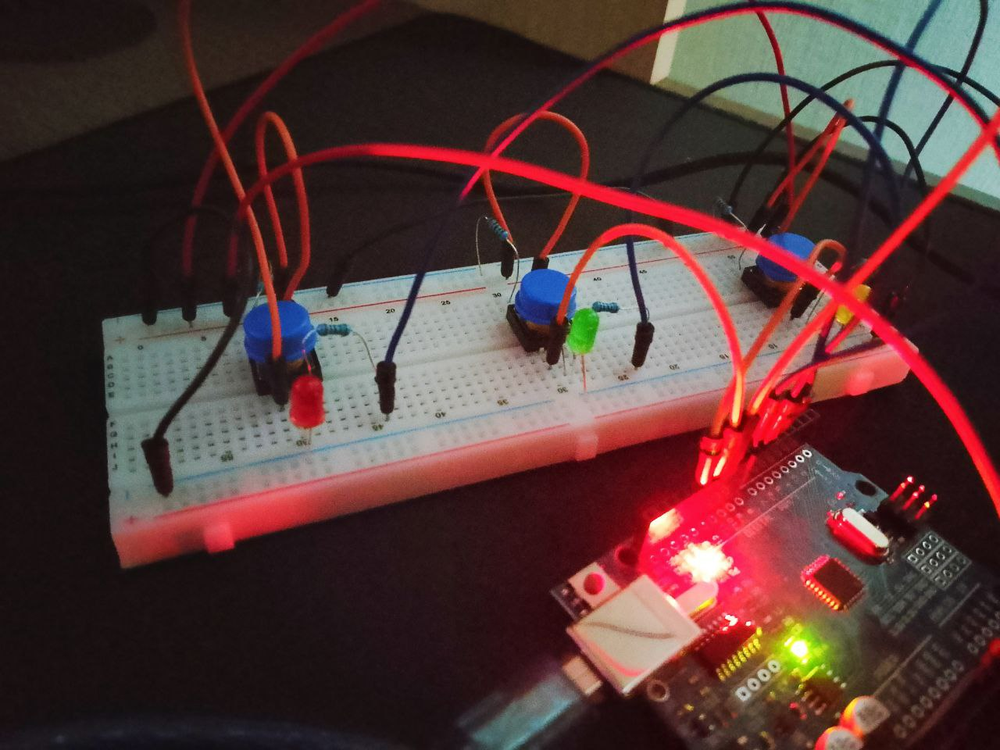
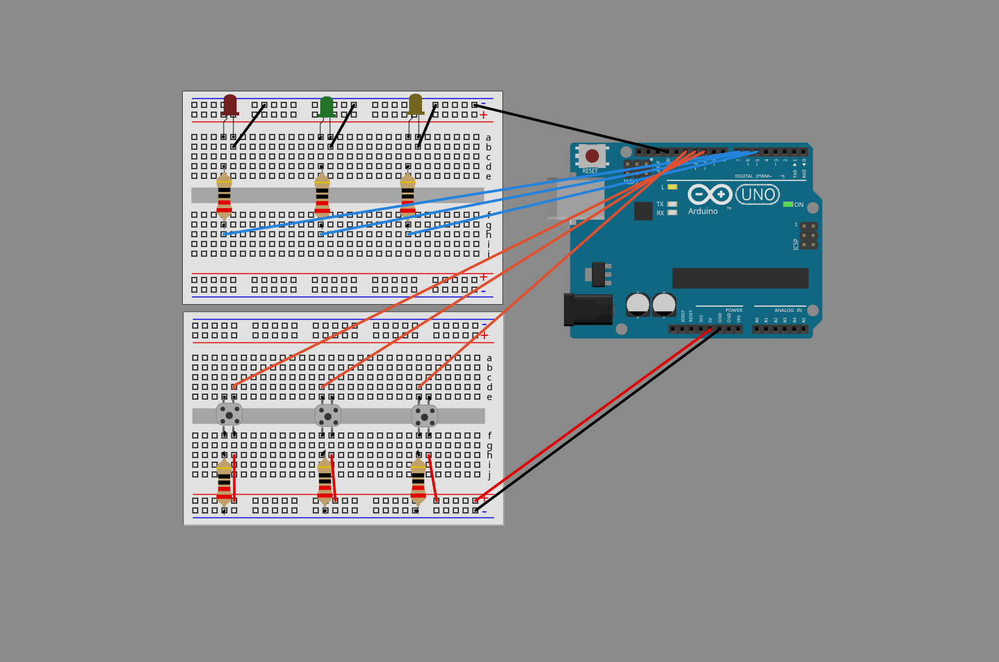
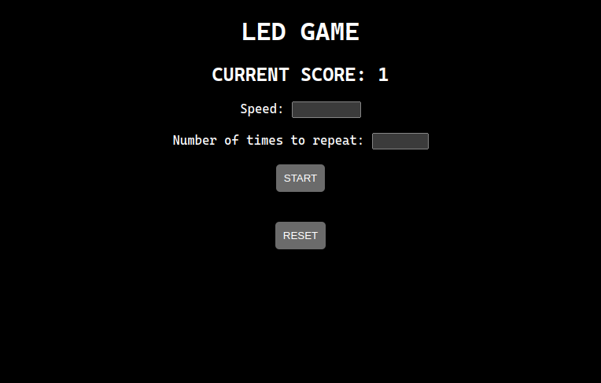

# IDEA

   

The system generates randomized light sequences that players must observe and reproduce accurately by inputting the correct order.

# STACK
- arduino uno (3 LEDs, 3 push buttons)
- Golang (net/http) for web interface
- Python for utils

# RUN
- connect arduino (make sure it's running on `tty/USB0`
- run the script: `./run.sh`
- open `localhost:8080`

<figure>
    <figcaption>Circuit of arduino uno</figcaption>
</figure>
   
<figure>
   
    <figcaption>Web interface to play</figcaption>
</figure>
